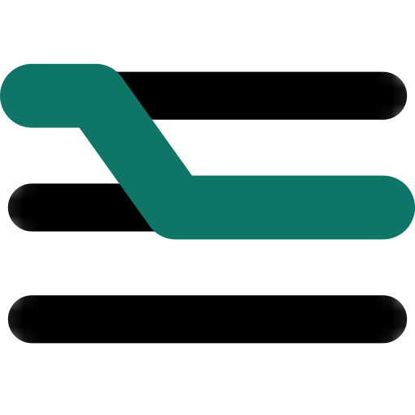
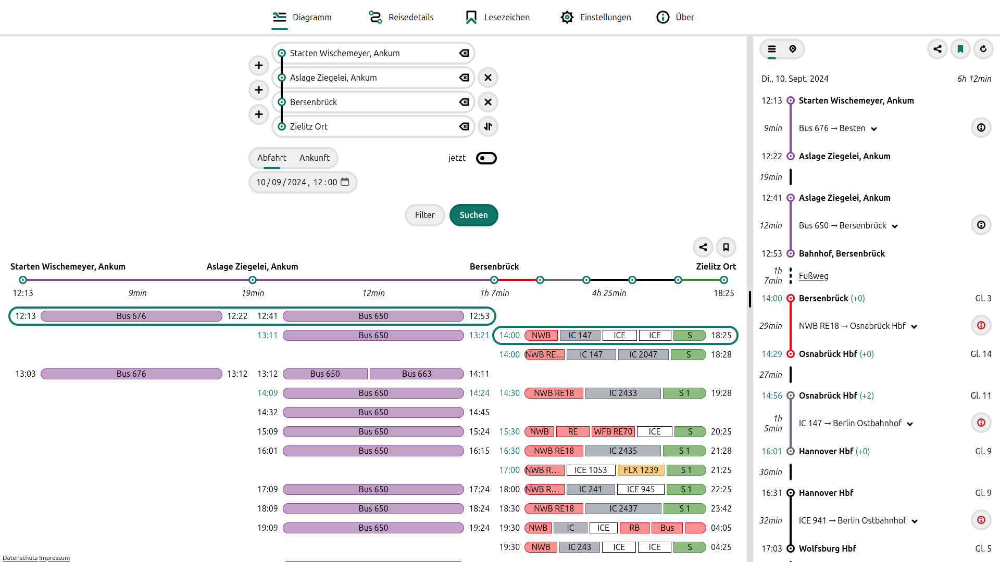
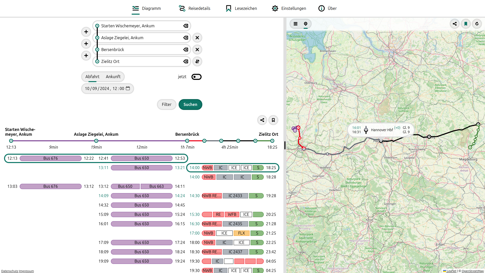
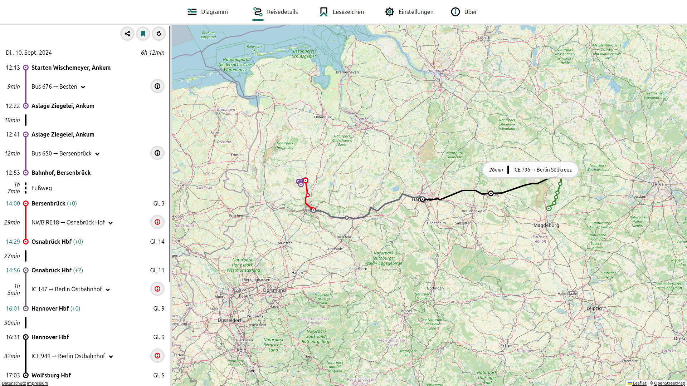
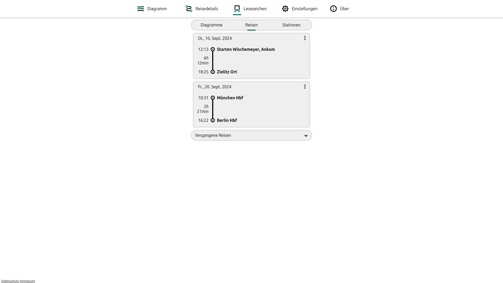
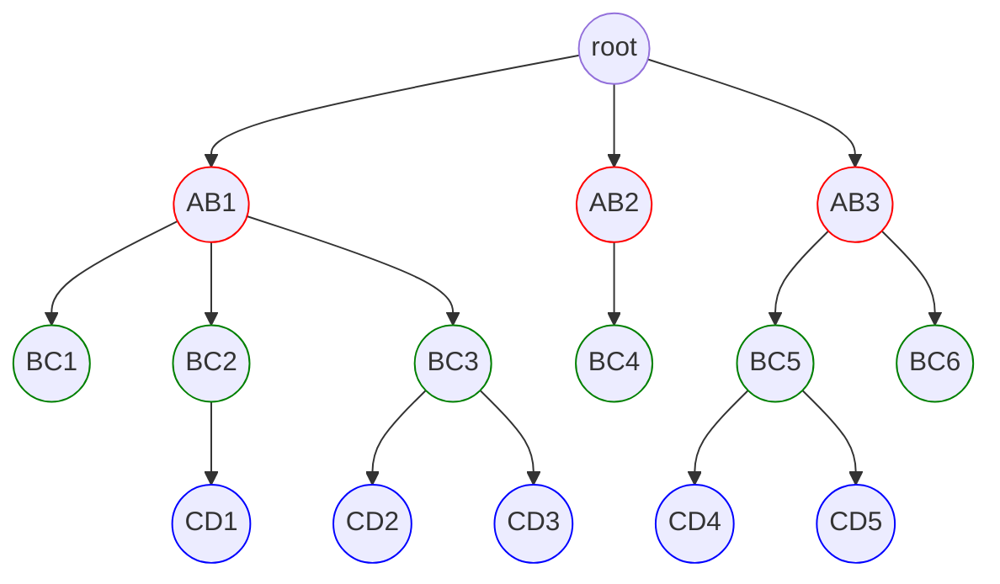
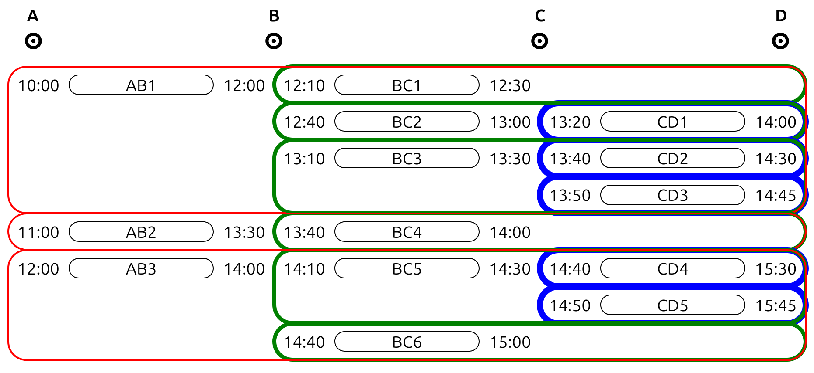

# Vahrplan 

_**V**oll**a**utomatische **H**ilfe für **R**outen**plan**ung_ (vahrplan) is a web application assisting users of public transport in Germany on planning longer journeys with transfers.

Users can investigate possible transfers in a detailed way in order to prepare for delays/cancellations in advance and/or incorporate longer stays into their journey. This is achieved by fetching journeys between all selected stopovers from [`Hafas`](https://de.wikipedia.org/wiki/HAFAS) and visualizing how they relate to each other in an interactive diagram.

This app is intended to be some sort of hybrid between [DB Navigator](https://bahn.de) and [Time-Space Train Planner (TSTP)](https://github.com/traines-source/time-space-train-planner).

An earlier version of this project can be found [here](https://github.com/dabund24/Zug).

## Live Demo

[https://vahrplan.de](https://vahrplan.de)

## Features

This app can...

- find possible sub-journeys between multiple stations, addresses and poi

- visualize temporal relations between these sub-journeys

- merge sub-journeys to a new journey

- show details and live data of journeys

- show journeys on a map

## Build instructions

### Build with Docker

Prerequisites:

- `Docker` with Compose plugin

Instructions:

- Copy `.env.example` to `.env`
- Run `docker compose up --build`

The app should now run on [`http://localhost:3000`](http://localhost:3000) and Umami runs on [`http://localhost:3001`](http://localhost:3001). Consult the [Umami Docs](https://umami.is/docs/login) for further instructions on how to get analytics. The environment variable `PUBLIC_UMAMI_SCRIPT` in `.env` can be used to insert the tracking script.

### Build with npm

Prerequisites:

- `node.js >= 22`
- `Valkey >= 6.2.0` (or `Redis >= 6.2.0`)

Instructions:

- Copy `.env.example` to `.env`
- Start Valkey with `valkey-server` (or Redis with `redis-server`) on Port 6379
- Run `npm install`
- Run `npm run build`
- Run `npm run preview`

The app is now running on [`http://localhost:4173`](http://localhost:4173)

## Tech Stack

### General Stuff

- Meta-Framework: SvelteKit
- OS-level Virtualization: Docker
- Linter: ESLint
- Code Formatter: Prettier

### Backend

- Runtime Environment: Node.js
- Database: Valkey

### Frontend

- Framework: Svelte
- Build-Tool: Vite

## Great projects this app relies on

- [hafas-client](https://github.com/public-transport/hafas-client)
- [Leaflet](https://leafletjs.com)
- [OpenStreetMap](https://www.openstreetmap.org)

## Screenshots

## How it works

### 1. Fetch sub-journeys

Assume we want to travel from `A` to `D` and know that on our journey we will have to change in `B` and `C`. Asking DB-Navigator for connections will give us the following "timetables":

_Journeys from `A` to `B`_

|    ID | Departure | Arrival |
| ----: | :-------: | :-----: |
| `AB1` |   10.00   |  12.00  |
| `AB2` |   11.00   |  13.30  |
| `AB3` |   12.00   |  14.00  |

_Journeys from `B` to `C`_

|    ID | Departure | Arrival |
| ----: | :-------: | :-----: |
| `BC1` |   12.10   |  12.30  |
| `BC2` |   12.40   |  13.00  |
| `BC3` |   13.10   |  13.30  |
| `BC4` |   13.40   |  14.00  |
| `BC5` |   14.10   |  14.30  |
| `BC6` |   14.40   |  15.00  |

_Journeys from `C` to `D`_

|    ID | Departure | Arrival |
| ----: | :-------: | :-----: |
| `CD1` |   13.20   |  14.00  |
| `CD2` |   13.40   |  14.30  |
| `CD3` |   13.50   |  14.45  |
| `CD4` |   14.40   |  15.30  |
| `CD5` |   14.50   |  15.45  |

Note that a journey can be a direct connection, but as opposed to TSTP doesn't have to be.

### 2. Arrange journeys in tree

In order to create the diagram we want, we first need to arrange the found journeys in a tree-like structure. Apart from the root, which has no semantic meaning, each level represents a section of the full journey. In our example, level 1 contains all journeys found from `A` to `B`, level 2 all journeys from `B` to `C` and level 3 those from `C` to `D`. We construct our tree with these rules:

- In each level, journeys are sorted by their departure time in ascending order

    _i.e. the further right a journey is in a level, the later it begins_

- The first child of a journey is the journey of the next level with the earliest departure where the departure of the child is still later than the arrival of its parent

    _i.e. the earliest journey one can reach from another journey is its first child_

From the rules above, we can derive this more general rule:

_All children of a journey and all children of all right siblings of a journey are "reachable" from it, but all children of all left siblings are not._

This results in this tree:

### 3. Reflect tree structure in HTML

When given a tree as the one seen above from the server, the frontend displays it such that all parent child relationships from the constructed tree also exist in the DOM, which results in this diagram:

Notice how the first child of each journey can be found directly to the right of that journey, whereas all "unreachable" connections are above it. This is a consequence of the rules we constructed the tree with. So to read this diagram, we can use this simple and intuitive rule: You can only travel rightwards and downwards, but never leftwards or upwards.
